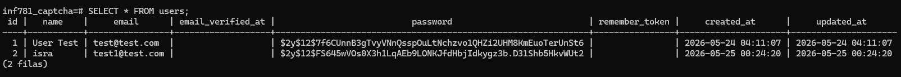
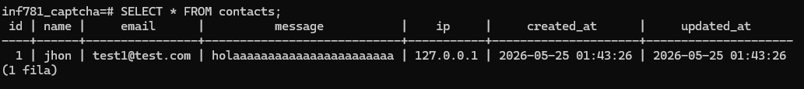
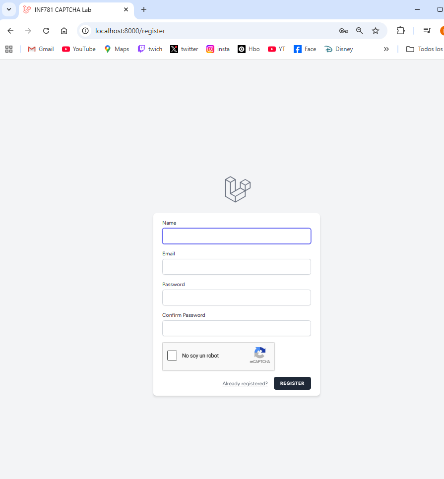
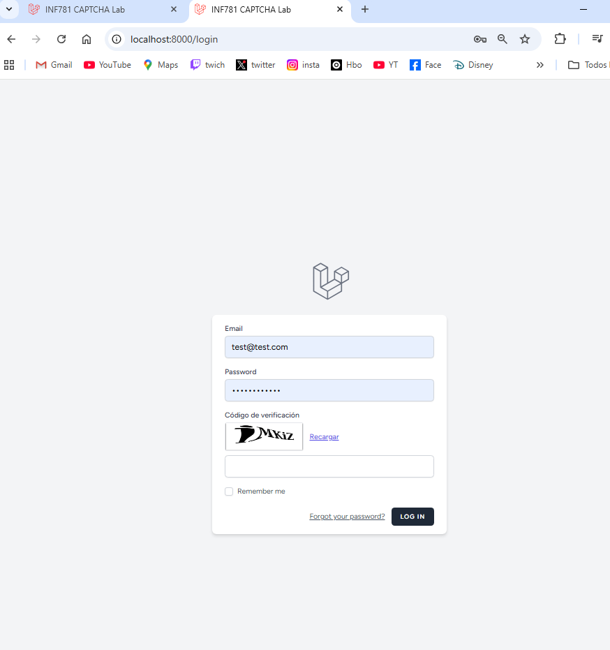
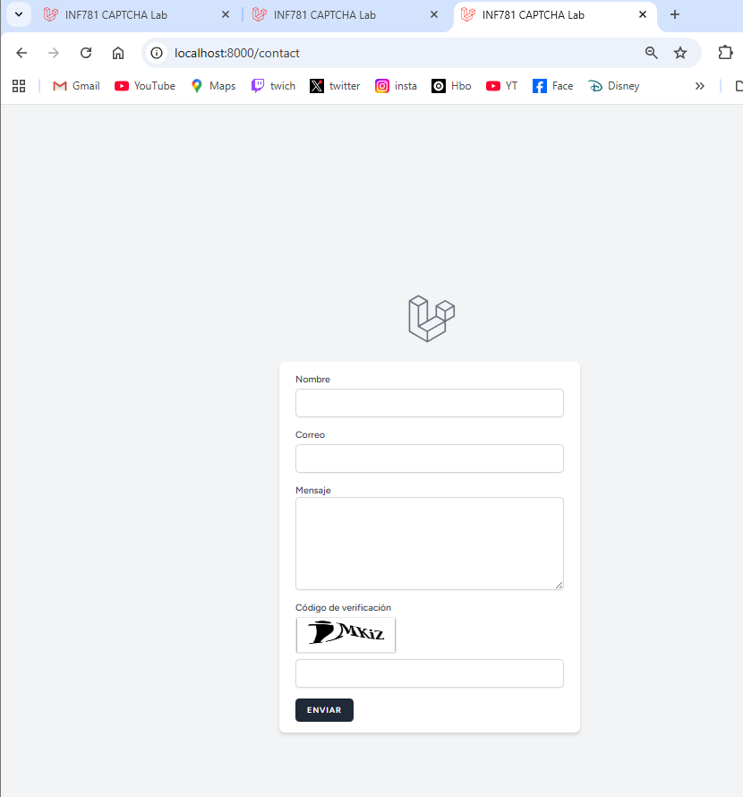
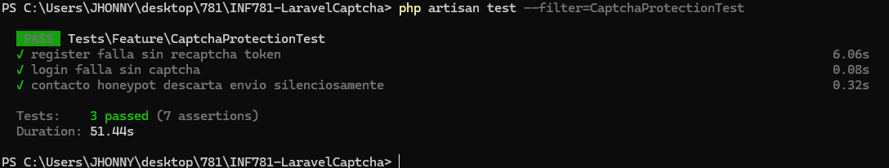

# INF781 - Laravel CAPTCHA Lab

Proyecto desarrollado en Laravel 13 para implementar mecanismos de protección contra bots utilizando:

- Google reCAPTCHA v2
- CAPTCHA dinámico en login
- Honeypot
- Rate limiting
- Validaciones y tests automatizados

---

# Descripción del proyecto

El objetivo de este laboratorio es implementar diferentes mecanismos de seguridad en formularios web para prevenir:

- Bots automatizados
- Spam
- Fuerza bruta
- Automatización de formularios

El sistema protege:

- Registro de usuarios
- Inicio de sesión
- Formulario de contacto

---

# Requisitos

## Software requerido

- PHP 8.3+
- Composer
- PostgreSQL
- Node.js
- NPM
- Laravel 13

---

# Instalación del proyecto

## 1. Clonar repositorio

```bash
git clone https://github.com/TU_USUARIO/INF781-LaravelCaptcha.git
```

---

## 2. Entrar al proyecto

```bash
cd INF781-LaravelCaptcha
```

---

## 3. Instalar dependencias

```bash
composer install
npm install
```

---

## 4. Configurar entorno

Copiar archivo:

```bash
cp .env.example .env
```

---

## 5. Configurar base de datos

Editar `.env`

```env
DB_CONNECTION=pgsql
DB_HOST=127.0.0.1
DB_PORT=5432
DB_DATABASE=inf781_captcha
DB_USERNAME=postgres
DB_PASSWORD=postgres
```

---

# Configuración de Google reCAPTCHA

## 1. Obtener claves

Ingresar a:

https://www.google.com/recaptcha/admin

---

## 2. Crear sitio reCAPTCHA v2

Seleccionar:

- reCAPTCHA v2
- "No soy un robot"

---

## 3. Configurar claves en `.env`

```env
RECAPTCHA_SITE_KEY=6LdffPksAAAAAIGJ9KlsyW6W9MPfGXNnXDktjJyU
RECAPTCHA_SECRET_KEY=6LdffPksAAAAAB1_gnW1TEfG3z0ZybKDhT-rFTFn

```

---

# Generar aplicación

## Generar APP_KEY

```bash
php artisan key:generate
```

---

## Ejecutar migraciones

```bash
php artisan migrate
```

---

## Ejecutar servidor Laravel

```bash
php artisan serve
```

---

# Ejecutar tests

```bash
php artisan test --filter=CaptchaProtectionTest
```

---
# Persistencia en Base de Datos

## Usuarios registrados



---

## Mensajes del formulario de contacto



# Formularios protegidos

## Registro protegido con Google reCAPTCHA

- Validación anti-bot
- Protección contra registros automáticos



---

## Login protegido con CAPTCHA dinámico

- CAPTCHA visual
- Validación manual del código



---

## Formulario de contacto protegido

- Honeypot
- Rate limiting
- CAPTCHA visual



---

# Tests automatizados

Pruebas implementadas:

- Validación CAPTCHA
- Protección Honeypot
- Protección Rate Limiting



---

# Análisis crítico

## Amenazas mitigadas

### Registro

- Bots automáticos
- Creación masiva de cuentas
- Spam

### Login

- Fuerza bruta básica
- Scripts automatizados
- Bots de autenticación

### Contacto

- Spam automatizado
- Flooding
- Bots de formularios

---

# Comparación de mecanismos CAPTCHA

| Mecanismo | Ventajas | Desventajas |
|---|---|---|
| Google reCAPTCHA | Alta seguridad | Dependencia externa |
| CAPTCHA local | Mayor privacidad | Menor seguridad |
| Honeypot | Invisible al usuario | Bots avanzados pueden evitarlo |

---

# Vulnerabilidades residuales

Aunque se implementaron mecanismos de protección, aún pueden existir amenazas como:

- OCR avanzado
- Bots con IA
- Servicios humanos de resolución CAPTCHA
- Ataques distribuidos

---

# Conclusiones

El laboratorio permitió comprender la importancia de proteger formularios web mediante múltiples capas de seguridad.

Se implementaron mecanismos anti-bot tanto visuales como invisibles para reducir automatizaciones maliciosas y mejorar la seguridad de la aplicación.

---

# Autor

- Nombre: JHON ISRAEL FUERTES
- Materia: INF781 Seguridad de Software
- Universidad: UATF
- Gestión: 2026

---

# Licencia

Proyecto académico desarrollado únicamente con fines educativos.